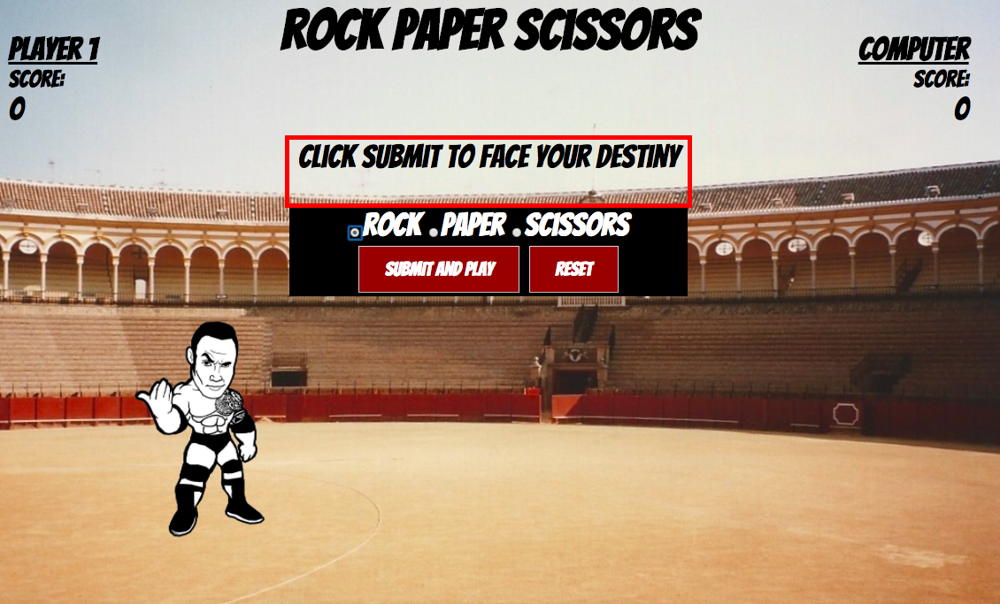

## Name: Tony Bricca

# Project Name: Rock, Paper, Scissors</h1>

## Tech Used: 
1. HTML 
2. CSS
3. Javascript
4. Jquery
5. Git/Github
6. Trello

## Instructions: 

Select your weapon (rock, paper or scissors) of choice and click 'Submit', this will prompt a 3 second countdown until the computer plays its' turn. The winner will then be determind and the score will be updated on the top of screen.

## Process: 
   

I built this game to better hone in my understanding of Jquery and Javascript as I had trouble with it on the previous deliverables. I begin by psuedo coding and drawing out the idea of the game in my notebook. I had thought about having a Player 2 option, but it seemed like it would defeat the challenge of the game if the player could see on the screen what the other player was going to use. I then utilized Trello and created a scrum board for it to help figure out my process.

 ## Design 

The game was designed to look like you're playing in a gladitator arena. I have the opponenets face off like a classic video game in order to make the game Rock, Paper, Scissors that much more appealing. There is a countdown timer to dramatize the feel of it and a scoreboard in the middle that announces who won each round. 

## Screen Shot

## Next Steps

 My next steps will be to add a Player 2 function along with a few more animations to bring some more excitement to the game.

